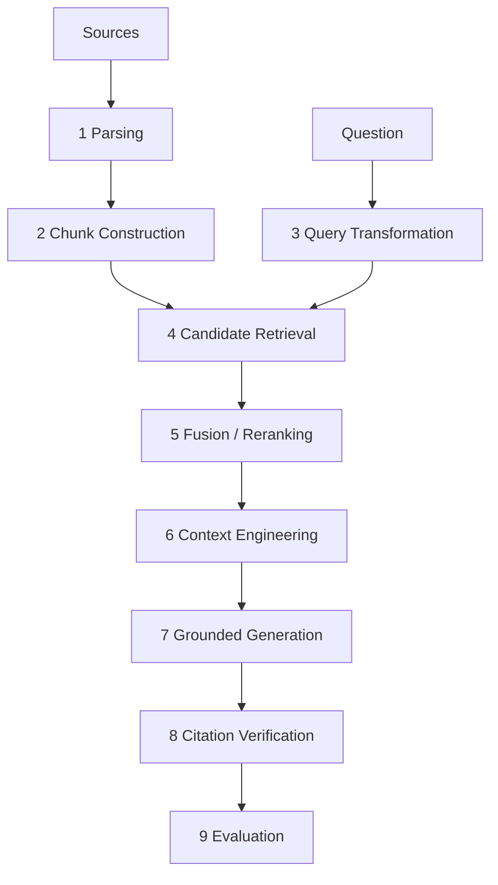
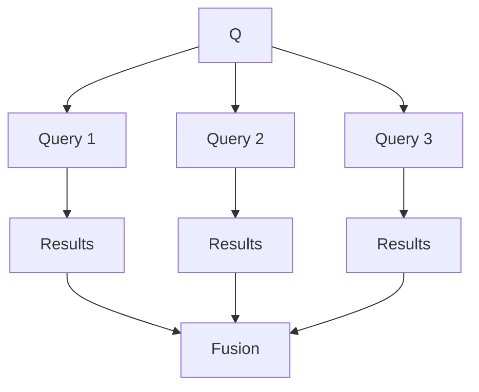
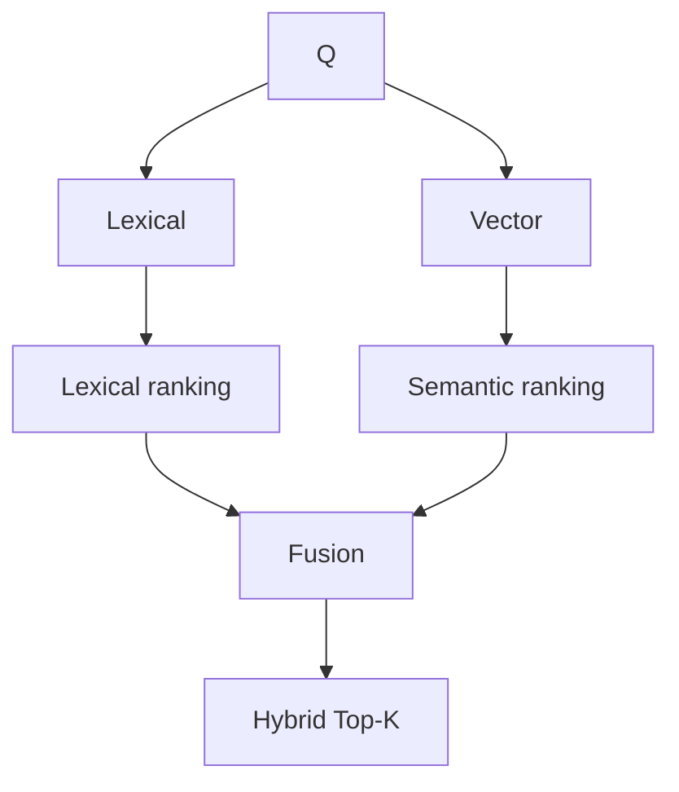
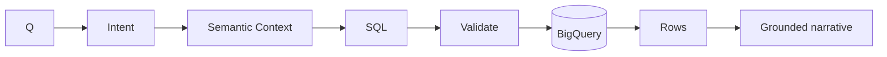
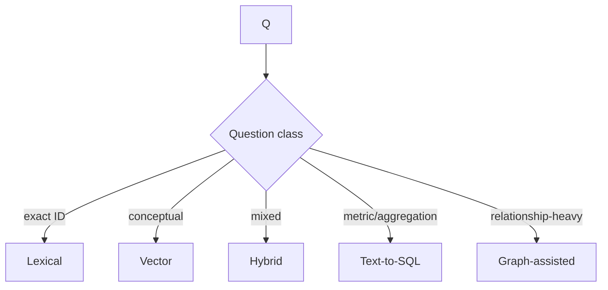
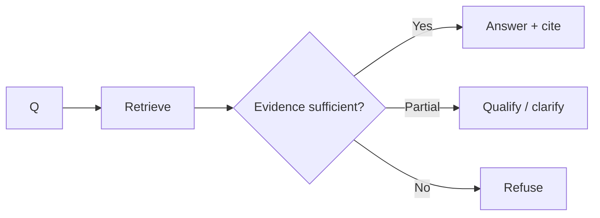
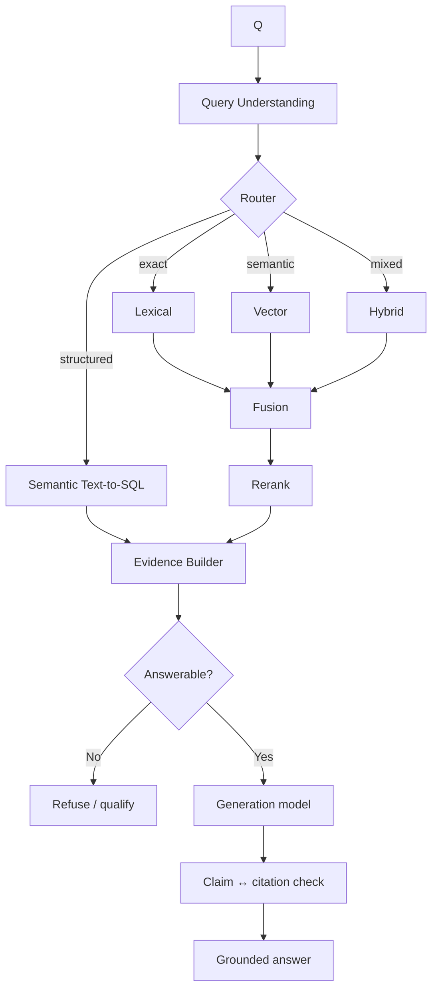

# 01 — Advanced RAG Patterns: Retrieval Engineering
**Module 04 | 40–50 min | Senior audience**  
Assume participants already know vanilla RAG, embeddings, chunking and Top-K vector retrieval.

## 1. The shift
Semantic similarity is not evidence quality.



**FDE mindset:** start from the retrieval failure mode, not the retrieval technology.

## 2. Pattern 01 — Structure-aware parsing
**Failure:** PDF→plain text destroys headings, tables, page/section boundaries and provenance.  
**Pattern:** preserve document→section→paragraph/table plus page, source URI and version.  
**Use:** contracts, policies, manuals, reports.  
**FDE test:** can the answer point to the correct page/section/table?

## 3. Pattern 02 — Adaptive / structure-aware chunking
Fixed 500-token chunks are convenient, not inherently correct.

| Strategy | Best for |
|---|---|
| Fixed/recursive | baseline prose |
| Heading-aware | policies/manuals |
| Semantic boundary | topic transitions |
| Table-aware | reports/data |
| Code-aware | functions/classes |
| Adaptive | heterogeneous documents |

> Ask “what unit of evidence must survive intact?”, not merely “what chunk size?”

## 4. Pattern 03 — Parent-child / small-to-big
Search small chunks for precision, return a larger parent for sufficient context.


## 5. Pattern 04 — Contextualized chunks
Ambiguous chunk: `The limit is 15 minutes.`  
Add local context before indexing: `Inventory freshness requirement for Stockout Agent: The limit is 15 minutes.`

Anthropic's Contextual Retrieval is a useful industry pattern: contextualized chunks + semantic retrieval + lexical retrieval + fusion/reranking. Published gains are benchmark-specific, not universal guarantees.

## 6. Pattern 05 — Query rewriting
Translate user language into corpus language while retaining the original query.

```text
"products disappearing from shelf"
        ↓
"store SKU stockout risk projected inventory"
```

**Risk:** rewriting can distort intent. Log/evaluate both original and rewritten queries.

## 7. Pattern 06 — Multi-query retrieval
Generate alternate searches for the **same evidence need**, retrieve in parallel, fuse/deduplicate.



Recall ↑; cost/latency/noise may also ↑.

## 8. Pattern 07 — Query decomposition
Split a multi-hop question into **different evidence needs**.

`Which supplier caused most stockout exposure AND what escalation policy applies?`
→ retrieve exposure → retrieve policy → combine.

Multi-query = alternate searches for same evidence.  
Decomposition = different subproblems.

## 9. Pattern 08 — HyDE
```text
Question → hypothetical document/answer → embed → retrieve real evidence
```
Useful when short queries look unlike corpus passages.  
**Never cite the hypothetical output; it is retrieval scaffolding, not evidence.**

## 10. Pattern 09 — Metadata filtering
Similarity + mandatory constraints such as region, year, tenant, status, version, classification.

```yaml
region: Mumbai
document_version: 2026
status: approved
```

Often a **governance control**, not just relevance optimization.

## 11. Pattern 10 — Lexical retrieval
Best for exact tokens: `SKU-0921`, `INV-7.4.2`, error codes, acronyms, rare names.

> Exact identifiers should not be forced through semantic similarity.

## 12. Pattern 11 — Dense semantic retrieval
Strong for conceptual equivalence:  
`items likely to disappear from shelves ≈ high stockout probability`.

Weaknesses can include exact IDs, rare names, version distinctions and operationally wrong but semantically similar chunks.

## 13. Pattern 12 — Hybrid retrieval
One of today's primary patterns.



Lexical supplies exactness; vector supplies meaning. BigQuery implementation comes in Resource 02.

## 14. Pattern 13 — Reciprocal Rank Fusion (RRF)
Lexical and vector scores have different scales. Fuse **rank positions** instead:

```text
RRF(d) = 1/(k + lexical_rank) + 1/(k + vector_rank)
```

Simple, robust, avoids direct score normalization.

## 15. Pattern 14 — Weighted / dynamic fusion
```text
final = α × semantic + β × lexical
```
Weights can be query-aware: exact identifier → lexical ↑; conceptual query → semantic ↑.

**Warning:** dynamic weighting needs evaluation; otherwise it adds another probabilistic layer without proven value.

## 16. Pattern 15 — Reranking
First-stage retrieval optimizes recall; reranking refines ordering.


Use expensive intelligence on a small candidate set, not the entire corpus.

## 17. Pattern 16 — Context compression
Trim irrelevant content while preserving claims and provenance.

**Risk:** compressors can remove qualifications/exceptions. Always retain a pointer to unaltered source evidence.

## 18. Pattern 17 — Neighbor/window expansion
Retrieve chunk N, then add N−1/N+1 or its parent. Separates **search granularity** from **generation granularity**.

## 19. Pattern 18 — Text-to-SQL as retrieval
For `Which five stores had highest stockout risk last week?`, vector RAG may be wrong.



Resource 03 covers naive→metadata→semantic-layer→verified-query→validate/repair patterns.

## 20. Pattern 19 — Retrieval routing
Do not send every question to one retriever.



Prefer a retrieval **plan**, not just a label:

```yaml
strategy: hybrid
filters: {region: Mumbai}
lexical_weight: high
rerank: true
top_k: 8
```

## 21. Pattern 20 — Graph-assisted retrieval
Bridge only today.

Vector: `Which chunks are similar?`  
Graph: `Which entities are connected through which relationships?`

Tomorrow owns ontology/KG in depth.

## 22. Pattern 21 — Caching
Distinguish:
- embedding cache,
- retrieval/result cache,
- prompt/context cache,
- semantic answer cache.

Cache keys must consider corpus/data version, tenant/user authorization, semantic-layer version and freshness SLA.

> A fast stale answer is still wrong.

## 23. Pattern 22 — Citation-aware indexing
Provenance must survive ingestion:

```yaml
chunk_id: policy-2026-p18-c04
source_id: inventory-policy-2026
source_type: pdf
page: 18
section: "4.2 Inventory Freshness"
document_version: "2026-08-01"
```

Structured evidence should preserve table, record key and `as_of`.

```text
source → parsed unit → indexed unit → retrieved evidence → claim → citation
```

This is **grounding lineage**.

## 24. Pattern 23 — Refusal-aware retrieval


Signals: no relevant evidence, stale data, required source absent, authoritative conflict, inaccessible corpus, unsupported claim.

Similarity score alone is not a universal confidence score.

## 25. Pattern 24 — Evaluate retrieval separately
If an answer is wrong, determine whether:
1. evidence was never retrieved,
2. evidence ranked too low,
3. evidence reached LLM but reasoning failed,
4. answer was right but citation mapping failed.

Retrieval: Recall@K, Precision@K, MRR, nDCG, hit rate.  
Generation: groundedness/faithfulness, answer relevance, citation correctness, refusal accuracy.

> If retrieval recall is poor, changing the generation model may be irrelevant.

## 26. Five architectures worth showing

### A. Hybrid RAG
`lexical + vector → RRF → rerank → grounded answer`  
Strong advanced baseline for heterogeneous enterprise documents.

### B. Contextual RAG
`contextualize chunks → lexical + semantic → fuse → rerank`  
Useful for long/repetitive corpora.

### C. Routed RAG
`question → lexical | vector | hybrid | SQL`  
Useful for mixed enterprise knowledge.

### D. Corrective/agentic retrieval
`retrieve → assess → rewrite/decompose/retrieve again → answer/refuse`  
Powerful when iteration improves answerability; loops add latency/cost.

### E. Graph-enhanced RAG
`semantic evidence + relationship traversal → combined evidence`  
Bridge to Module 05.

## 27. Anti-patterns
1. “We have a vector DB, therefore we have RAG.”
2. Increase Top-K until the answer appears.
3. One chunk size for every source.
4. Let LLM invent business semantics.
5. Use vector RAG for aggregation.
6. Treat similarity as factual confidence.
7. Add reranking without measuring retrieval.
8. Cite a document without mapping claims to evidence.

## 28. Failure mode → first tactic

| Failure | First tactic |
|---|---|
| Exact SKU/clause missed | lexical/hybrid |
| Paraphrase missed | dense |
| Right paragraph lacks context | parent-child/window |
| Repetitive document wrong section | contextual chunks + metadata |
| Broad query misses aspect | multi-query |
| Multi-part question | decomposition |
| Too many mediocre hits | rerank |
| Lexical/vector scores incomparable | RRF |
| Question types vary | router |
| Aggregation/numeric | Text-to-SQL |
| Relationship-heavy | graph-assisted |
| Context too large | compression |
| Repeated expensive context | caching |
| No traceability | provenance/citation-aware indexing |
| Unsupported answers | answerability/refusal gate |
| Quality unclear | golden-set retrieval eval |

## 29. Trainer challenge
Ask participants to choose and defend the retrieval path:

| Question | Likely strategy |
|---|---|
| Maximum allowed inventory freshness? | semantic/hybrid + citation |
| What does `INV-7.4.2` say? | lexical-heavy hybrid |
| Five Mumbai stores with lowest projected inventory yesterday? | Text-to-SQL |
| Compare freshness policy with offline-store exception | multi-evidence hybrid + rerank |
| Supplier dependencies indirectly affecting SKU-0921? | graph-assisted bridge |

## 30. Production pattern we will build


## ## 31. FDE Review Checklist — What Good Answers Might Look Like

These are not prescribed answers. They are examples of the kinds of decisions an FDE should be able to extract, validate, and document with the customer.

| # | FDE Review Question | Possible Answers / Decisions |
|---:|---|---|
| 1 | **What question classes exist?** | **A.** Policy/explanatory questions → document RAG. **B.** Metrics, aggregations, trends → Text-to-SQL. **C.** Mixed questions → structured + unstructured retrieval. |
| 2 | **What is authoritative evidence?** | **A.** Only approved/versioned policy documents. **B.** Governed Gold-layer BigQuery tables for operational metrics. **C.** Knowledge Catalog/semantic definitions determine which source/version is authoritative. |
| 3 | **What is the smallest useful evidence unit?** | **A.** One policy clause/paragraph. **B.** A complete table row at `store × SKU` grain. **C.** A small chunk for retrieval, expanded to its parent section before generation. |
| 4 | **Which exact identifiers must survive?** | **A.** SKU/product IDs such as `SKU-0921`. **B.** Policy clauses such as `INV-7.4.2`. **C.** Supplier, store, contract, ticket, error-code or campaign IDs. |
| 5 | **Which metadata filters are mandatory?** | **A.** `region = Mumbai`. **B.** `document_status = APPROVED` and latest effective version. **C.** Tenant/customer/business-unit filters required by access policy. |
| 6 | **Which questions require SQL?** | **A.** “Top 5 stores by stockout risk.” **B.** “How many SLA violations occurred yesterday?” **C.** Questions requiring aggregation, filtering, joins or calculations over governed structured data. |
| 7 | **How are lexical/vector candidates fused?** | **A.** Reciprocal Rank Fusion (RRF). **B.** Fixed weighted fusion such as lexical 40% + semantic 60%, validated against the golden set. **C.** Query-aware weighting where identifier-heavy questions favor lexical retrieval. |
| 8 | **Does reranking measurably help?** | **A.** Recall@20 remains similar but relevant evidence moves from rank 8 to rank 2. **B.** nDCG/MRR improves enough to justify added latency. **C.** No meaningful improvement → remove reranker and avoid unnecessary cost/complexity. |
| 9 | **What provenance survives ingestion?** | **A.** Document ID + version + page + section. **B.** BigQuery table + record key + `as_of` timestamp. **C.** Every retrieved chunk retains a stable source URI and evidence ID that can become a citation. |
| 10 | **How is freshness handled?** | **A.** Inventory evidence must be <15 minutes old. **B.** Policies remain valid until superseded by a newer approved version. **C.** Stale evidence may be retrieved but must trigger qualified/refusal behavior rather than being presented as current. |
| 11 | **When must the system refuse?** | **A.** No authoritative evidence was retrieved. **B.** Required data is stale or fails quality rules. **C.** Sources conflict and the system cannot determine the authoritative version. |
| 12 | **Retrieval failure or reasoning failure?** | **A.** Required evidence never appeared in Top-K → retrieval failure. **B.** Correct evidence was retrieved but ranked below the context cutoff → ranking failure. **C.** Correct evidence reached the model but the answer contradicted it → reasoning/generation failure. |
| 13 | **What is the latency/cost budget?** | **A.** Interactive employee assistant: target <3–5 sec end-to-end. **B.** Complex analytical question can tolerate 10–20 sec for SQL + multiple retrieval paths. **C.** Reranking/multi-query is enabled only where measured quality improvement justifies additional model calls. |
| 14 | **What invalidates caches?** | **A.** New document/policy version. **B.** Change to underlying BigQuery data beyond the freshness SLA. **C.** User permissions, tenant context, semantic definition, embedding model or retrieval configuration changes. |
| 15 | **What golden set proves it still works?** | **A.** 50–100 representative questions with expected evidence IDs. **B.** Include exact-ID, semantic, SQL, hybrid, ambiguous and unanswerable questions. **C.** Every production retrieval change must pass agreed Recall@K, citation correctness and refusal-accuracy thresholds. |

### How an FDE Should Use This

The objective is not simply to ask these 15 questions. The FDE should turn the answers into **explicit architecture decisions and acceptance criteria**.

For example:

```yaml
retrieval_contract:

  question_classes:
    policy_question: hybrid_rag
    analytical_question: text_to_sql
    mixed_question: sql_plus_rag

  authoritative_sources:
    policy: approved_policy_corpus
    operational_metrics: gold.inventory_health

  retrieval:
    lexical: true
    vector: true
    fusion: rrf
    rerank_top_n: 20
    generation_top_k: 6

  freshness:
    inventory_max_age_minutes: 15

  provenance:
    required:
      - source_id
      - source_version
      - page_or_record_key
      - evidence_timestamp

  refusal:
    no_authoritative_evidence: true
    stale_operational_data: true
    unresolved_source_conflict: true

  evaluation:
    golden_set_required: true
    measure:
      - recall_at_k
      - mrr
      - citation_correctness
      - refusal_accuracy

## 32. Takeaway
```text
Naive RAG
 ↓
Good parsing/chunking
 ↓
Hybrid retrieval
 ↓
Fusion + reranking
 ↓
Query transformation
 ↓
Retrieval routing
 ↓
Structured + unstructured grounding
 ↓
Citation + refusal contracts
 ↓
Evaluation + observability
 ↓
Graph-assisted grounding when relationships require it
```

> **The strongest RAG is not the one with the most layers. It is the one deliberately matched to the customer's questions, evidence, semantics, risk and operating constraints.**

## 33. Next resource
`02_BIGQUERY_VECTOR_HYBRID.md` will make this concrete with BigQuery: embedding storage/generation, `VECTOR_SEARCH`, exact vs ANN, vector indexes, lexical+semantic hybrid, RRF/weighting, reranking, provenance and a runnable retrieval comparison.
